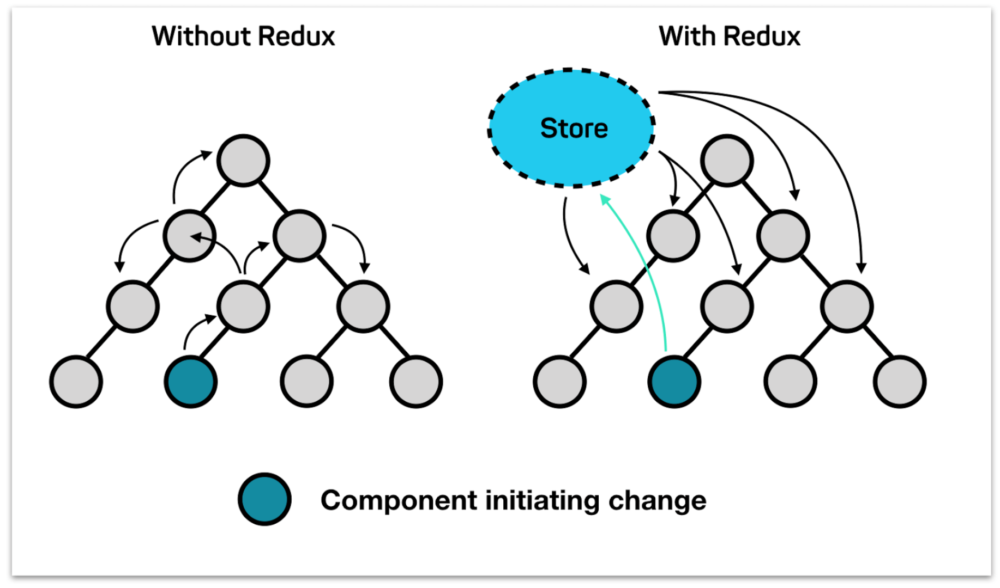
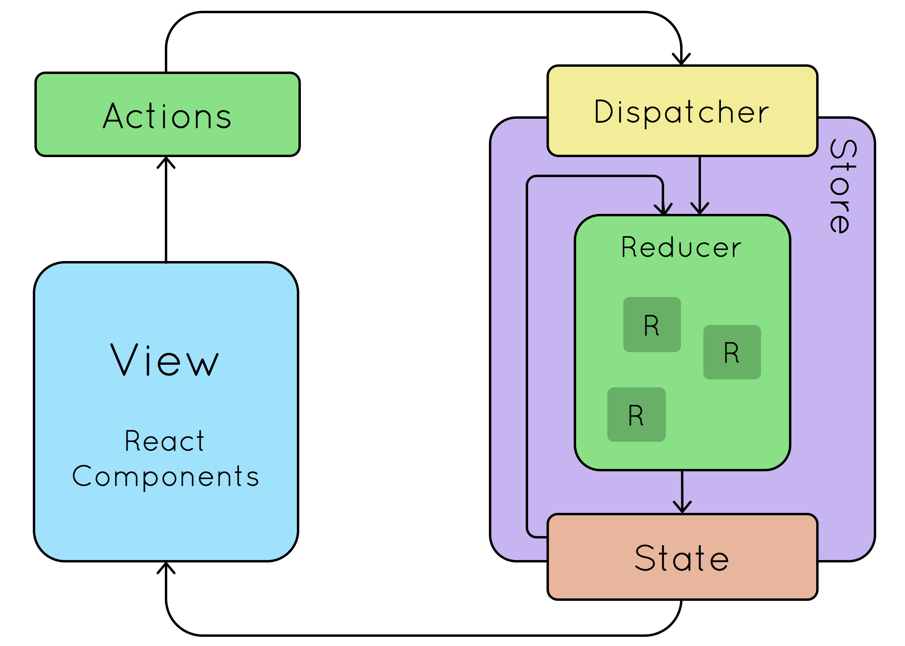

<h2>Basic Counter to understand redux</h2>


<ol>
  <li>for the counter itself, we need one value : count. This value won't be a react state here, but will be linked to redux state, and will be affected via reducers/actions</li>
  <p align="center">
    
  </p>
  <li>to do so we need to define firstly a store : store.js</li>
    <ul>
      <li>declared for the entire app, via index.js calling Provider with 'store' as the store</li>
      <li>within we'll have a call on each reducer</li>
    </ul>
  <li>so, we define our reducer for our counter : counterReducer via a 'slice' (toolkit) defined in the file counterSlice.js</li>
    <ul>
      <li>the slice helps to define easily actions (increase, decrease) to be applied on the state, and give him an initial state</li>
    </ul>
  <p align="center">
    
  </p>
  <li>once done, we have to import all the elements needed in the component Counter, and use them:</li>
</ol>


```bash
  import { useDispatch, useSelector } from 'react-redux'
  import { decrease, increase } from './counterSlice'
```
